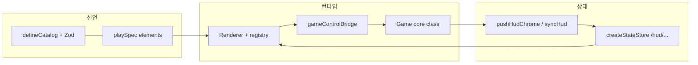

# Cursor·에이전트 협업 및 프로젝트 인수인계

이 파일은 **특정 게임 한 판의 구현 세부(예: 보드 규칙, 밸런스 수치, 해당 프로젝트만의 DOM id 목록 전체)** 를 적는 곳이 아니다.

**다음을 한 곳에 모아 두어, 새 미니게임·새 레포를 열 때 그대로 복제하거나 링크해 넘긴다.**

- 팀 역할과 **제작 단계(워크플로우)**
- 에이전트·개발자가 레포를 읽는 **순서 규칙**
- `GAME.md`·HTML 기획서·디자인 시스템 등 **기획 산출물 규격**
- **json-render + Three.js** 를 쓰는 경우의 **표준 폴더·부트 순서·세트 수정 규칙**
- 빌드·ZIP·Git·UI 패턴 등 **반복해서 깨지는 지점**

게임별 헌법·DOM 금기·pitch·Anti-Patterns 의 상세는 **`GAME_[게임명].md`** 에 둔다. 이 문서는 **“어떻게 돌아가는 팀 공장인가”** 에 집중한다.

### 문서 목적·성공 정의 (반드시 읽을 것)

**왜 이 Markdown 이 존재하는가**

- Cursor·Claude·안티그래비티 등 **도구와 에이전트가 바뀌어도**, 같은 레포에서 **같은 인수인계 세트**(이 파일 + `GAME_*.md` + 있으면 HTML 기획서·CSV·노션 링크)를 주었을 때 **새로 개발을 시작하거나 이어 받아도** 결과가 흩어지지 않게 하기 위해서다.
- 목표는 **“유사한 게임”** 이 나오게 하는 것이다. 여기서 **유사**란 다음을 뜻한다.
  - **구조가 같다:** 부트 순서·폴더 역할(카탈로그 4분할·브리지·스토어)·json-render 와 Three 코어의 경계·빌드/ZIP 습관이 이 문서와 `GAME.md` 에 맞는다.
  - **진행이 같다:** 7단계 워크플로우·역할 분담·읽기 순서(md → html → json 은 있을 때만)를 따른다.
  - **체감·루프가 기획과 같다:** 화면 ID·ANI ID·pitch·`actions` 완전 목록 등 **헌법 문서**에 쓰인 플레이 의도에서 벗어나지 않는다.
- **비목표 (오해 금지):** 픽셀 단위 동일·난수까지 같은 **완전 복제**는 목표가 아니다. 그건 비용 대비 효과가 낮고, AI 세션마다 불가능에 가깝다. 대신 **재작업·구조 드리프트·같은 버그의 재발** 을 줄이는 것이 목적이다.

**한 줄로:** 이 md 와 `GAME_*.md` 를 같이 주면 **어떤 AI 로 새로 만들든 “같은 공장에서 나온 같은 라인의 게임”** 이 되도록 정렬한다.

---

## 1. 에이전트·개발자 공통: 레포를 여는 순서

코딩을 시작할 때 아래 순서를 따른다.

1. **Markdown (`*.md`)**  
   기획·인계·빌드 규칙·json-render 구조·`GAME_*.md` 등 **텍스트 SSoT** 를 먼저 읽는다.

2. **HTML (`*.html`)**  
   와이어프레임·정적 스펙 페이지가 있으면 **레이아웃·카피·화면 흐름** 참고용으로 읽고 구현에 반영한다.

3. **JSON**  
   **저장소에 해당 파일이 실제로 있을 때만** 읽는다. 경로에 없으면 **읽지 않고**, 없는 JSON을 **추측·생성해 근거 삼지 않는다.**

요약: **md + html 로 맥락을 잡고 코드에 옮기고**, **json 은 “있을 때만”.**

---

## 2. 팀 구성과 책임

| 담당 | 역할 |
| --- | --- |
| 기획자 | 카탈로그 테이블·`GAME.md` 방향 결정 |
| Claude | **1단계**: 노션 기획서·`GAME.md` 초안·HTML 기획서·CSV 초안 / **6단계**: `GAME.md` 검토·HTML 기획서 최종 |
| Cursor | **2~3단계**: 구조 구현·플레이 완성·**7단계** `GAME.md` 최종 대조 |
| 안티그래비티 | **4~5단계**: UI 완성·스타일·애니메이션 |

**렌더러:** Three.js 고정 (원칙: OrthographicCamera 기본)

**선언 레이어:** json-render (`@json-render/core`, `@json-render/react`, Zod)

---

## 3. 미니게임 제작 7단계 워크플로우

| 단계 | 담당 | 내용 |
| --- | --- | --- |
| **1** | **Claude** | 노션 기획서·HTML 기획서·`GAME.md` 초안·CSV 초안 |
| **2** | Cursor | `GAME.md`·CSV 반영·파일 구조 생성·npm 환경 |
| **3** | Cursor | 게임 로직 완성·빌드 검증·커밋 |
| **4** | 안티그래비티 | `index.html` 마크업·`style.css`·애니메이션 |
| **5** | 안티그래비티 + Cursor | `GAME.md` Anti-Patterns·Agent Audit Log 등 갱신 |
| **6** | **Claude** | `GAME.md` 양식 검토·HTML 기획서 최종 |
| **7** | Cursor | 소스와 `GAME.md` 최종 대조·커밋 |

**핵심 원칙:** `GAME.md` 와 이 인수인계 문서를 포함한 **동일 세트**를 주면, 어떤 AI 든 **구조·워크플로우·체감 면에서 유사한 게임**(위 “문서 목적·성공 정의” 참고)이 나와야 한다. 픽셀 단위 동일보다 **드리프트·재작업 비용 절감**이 목표다.

---

## 4. Cursor·에이전트 작업 습관

- **새 프로젝트 = 새 Cursor 대화 + 새 폴더** 가 기본. 이전 게임 맥락이 섞이면 경로·규칙이 꼬인다.
- **호출부·구현·상수**가 한 세트인지 의심하고, 바꾼 뒤에는 프로젝트 표준으로 **`npm run build`** 와 가능하면 **`npm run typecheck`** 를 함께 돌린다.
- **UI/기능 의도**가 기획과 다를 수 있으면 (특히 비개발 디렉터와 협업 시) **먼저 확인**하고 진행한다.

---

## 5. 기술 스택 (팩트·팀 표준)

아래는 팀에서 검증한 조합 예시다. 프로젝트마다 `package.json`에 맞춰 숫자만 조정한다.

```
Renderer:    Three.js (OrthographicCamera 원칙)
Declarative: @json-render/core ^0.19.0
             @json-render/react ^0.19.0  （반드시 core 와 메이저·마이너 페어）
Validation:  zod ^4.3.6
Language:    TypeScript
Bundler:     Vite
Entry:       src/main.tsx
Bootstrap:   src/bootstrapGame.ts
Game core:   src/game/[GameName].ts
```

의존성 `@json-render/core`, `@json-render/react`, `react`, `react-dom`, `zod`, `three` 는 **`dependencies`** 에 명시한다.

---

## 6. 표준 디렉터리·파일 구조

신규 게임 레포를 만들 때 **아래 골격을 기준선**으로 삼는다. 이름은 바꿔도 되나 **역할 단위(카탈로그 / 스펙·레지스트리 / 스토어 / 싱크 / 브리지 / 코어)** 는 유지한다.

```
src/
  main.tsx                    # React 루트 분기 (HUD Spec, 로비 Spec 등)
  bootstrapGame.ts            # CSV 검증, loadGameData, 게임 인스턴스 생성
  game/
    [GameName].ts             # 페이즈, Three 레이아웃, 스폰, 충돌
    loadGameData.ts
    runnerDataPaths.ts        # CSV 경로 상수 (SSoT)
    hudExternalStore.ts       # HUD $state 스토어
    gameControlBridge.ts      # 명령형 ↔ 선언형 브리지
    textCopyIds.ts            # text_id 상수 (프로젝트에 있을 때)
  catalog/
    [game]Catalog.ts                      # defineCatalog() 단일 진입
    [game]CatalogOperationalUi.ts        # 화면에 실제로 올라가는 타입
    [game]CatalogStubsAndMaterials.ts    # CSV 재료·개념 스텁
    [game]CatalogShared.ts               # hudBindProp 등 공통 Zod
  jsonRender/
    GameJsonHud.tsx
    GameLobbyCopySpec.tsx
    GameOverlayActionButtons.tsx
game_data/
  01_*.csv
  02_*.csv
  ...
docs/
  GAME.md 또는 GAME_[name].md
  (선택) JSON_RENDER_[Game]_Guide.md · DEVELOPMENT_STRUCTURE.md
```

---

## 7. 데이터 SSoT 파이프라인

```
CSV / JSON
  → runnerDataPaths.ts (경로 상수)
  → Zod 검증
  → assembleSpec() 등 조립
  → Registry
  → 화면
```

**원칙:** 데이터 파일 경로는 **한 축**에서만 바꾼다. 경로를 바꿀 때는 **Catalog Zod 리터럴·파서·연구용 Spec** 을 **동시에** 패치한다.

---

## 8. `GAME.md` 작성 규칙 (`SPEC.md` 기준 정렬)

### 8.1 구조

`GAME.md` = **YAML front matter** + **Markdown body**

```yaml
---
identity:
  name: ""
  genre: []
  platform: []
  players: 1
  pitch: ""   # 가장 중요. 명시되지 않은 상황의 판단 기준.

components:
entities:
mechanics:
  turn_structure: realtime | turn-based | phase-based
  actions: {}   # 완전한 목록. 없는 action 은 유효하지 않음.
  loops: []

goals:
  win:
  loss:
---

## Design Pillars
## Mechanics in Depth
## Content Guidelines
## Anti-Patterns
```

### 8.2 핵심 규칙

- `pitch` 는 한 문장. 모든 판단의 기준점.
- `players` 는 정수 또는 범위 문자열 (`"1-4"`). `"2+"` 형식 금지.
- 네 개 고정 섹션 순서 **변경 불가**: Design Pillars → Mechanics in Depth → Content Guidelines → Anti-Patterns  
- 추가 `##` 섹션은 **Anti-Patterns 뒤에만** 붙인다.
- `actions` 는 **완전한 목록**이어야 한다.

### 8.3 자주 함께 두는 블록 (Unsanity Runner 등 참고)

- `implementation`: 언어·번들러·파일 구조·데이터 SSoT 파이프라인
- `json_render_declaration_layer_injection`: 카탈로그 파일·HUD spec·액션 브리지
- `## User Flow`: 화면 전환·화면 ID
- `## DOM Elements`: `dom_required_ids` 재현 체크리스트
- `## Animation Specifications`: ANI ID 별 트리거·수치
- `## Content Guidelines`: CSV 교차 참조
- `## Anti-Patterns [CRITICAL]`

구조를 바꾸면 **`GAME.md` 와 (있을 경우) `JSON_RENDER_*_Guide.md` 둘 다** 업데이트한다.

---

## 9. json-render 한 줄 정의와 목표

**목표:** 재료(Catalog)와 조리책(`GAME.md`)이 고정되면 Cursor·GPT·Claude 가 **같은 방향**으로 만든다. “픽셀 단위 동일”보다 **재작업·버그 반복 감소**가 목표다.

json-render 는 **카탈로그에 정의된 컴포넌트만** 쓰도록 제한하는 **선언 UI** 프레임워크다. 게임 **루프·충돌·물리** 는 성능과 제어를 위해 **명령형(Three.js 코어)** 으로 남긴다.

**한 줄 정의 (층):**

- **선언층:** Spec 트리 (`root` + `elements`) 로 화면 골격과 `props` → `$state` 바인딩.
- **계약층:** `defineCatalog` + Zod 로 타입·props·**액션 이름·파라미터** 고정.
- **상태층:** `createStateStore` 등으로 `/hud/…` 플랫 상태. 코어가 주기적으로 갱신(push/sync).
- **실행층:** `ActionProvider` 가 `on: { press: { action } }` 를 핸들러에 연결 → **얇은 브리지** → 코어 메서드.
- **렌더층:** `Renderer` + **registry** — `type` 문자열과 React 구현 1:1 매핑.

**경계:** 게임 규칙·보상 계산·물리·WebGL·타이머 재진입은 **json-render 밖** (`[GameName].ts` 등). 선언은 **표시와 입력 라우팅**, 코어는 **밖**.

---

## 10. 네 레이어 아키텍처 (표)

| # | 레이어 | 역할 | 성격 |
| --- | --- | --- | --- |
| ① | Catalog | 쓸 수 있는 구성품 이름·스키마 | 선언형 |
| ② | Spec | 이번 화면 조합 “주문서” | 선언형 |
| ③ | State / Bridge | `$state`·액션 브리지 | 연결 |
| ④ | Runtime | Three.js 루프·충돌·물리·부트 | 명령형 |

### 10.1 주방 비유

| 용어 | 비유 |
| --- | --- |
| Catalog | 메뉴판 |
| Spec | 주문서 |
| State | 값 상자 (`$state` 로 꺼냄) |
| Runtime | 주방 |

### 10.2 세 종류 카탈로그 (형식은 같고 내용만 다름)

| 종류 | 예시 type | 목적 |
| --- | --- | --- |
| 공식 웹 UI | Button, Card, Table… | 범용 UI |
| R3F 3D | Group, Stars… | 씬 그래프 (해당 시) |
| 게임 전용 | Hud*, Lobby*, DataMaterial_* … | HUD·로비·CSV 재료 |

모두 `defineCatalog() + Zod + 컴포넌트별 props` 패턴이 동일하다.

---

## 11. 데이터 흐름 (참고 다이어그램)



---

## 12. 카탈로그 파일 네 개 분리 (약속)

| 파일 | 역할 | 약속 |
| --- | --- | --- |
| `[game]Catalog.ts` | 단일 관문, `defineCatalog()` 한 번 | 외부는 이 파일만 import |
| `[game]CatalogOperationalUi.ts` | 실제 화면에 그려지는 컴포넌트만 | 여기 있는 것 = 화면 후보 |
| `[game]CatalogStubsAndMaterials.ts` | CSV 경로·개념 스텁 | registry 없을 수 있음 — 화면에 안 나올 수 있음 |
| `[game]CatalogShared.ts` | `hudBindProp` 등 공통 Zod | 규칙 변경 시 이 파일부터 |

**한 파일에 몰아넣으면 생기는 문제:** “카탈로그에 이름이 있으니 구현된 줄 알았다” → **registry 누락** 버그.

---

## 13. 카탈로그에 넣지 않는 것 / 넣는 것

| 넣지 않는 것 | 넣는 것 |
| --- | --- |
| 색·크기·폰트 같은 순수 UI 값만 덩어리 | Wheel 등 **존재 선언** |
| weight, cost 같은 **규칙 값만** | SpinButton 등 **존재 선언** |
| 회전 시간 등 연출 숫자만 | TokenDisplay 등 **존재 선언** |
| `weightedRandom()` 등 로직 | `DataMaterial_*` — **CSV 경로 리터럴** |
| 카메라 위치 등 (표현 레이어는 별도 데이터가 담당) | bindsTo 등 **참조용 메타** |

카탈로그는 **이름과 계약** 이지, 게임 규칙 전체가 아니다.

---

## 14. `hudBindProp` (HUD 동적 필드 타협)

```ts
// 개념적 예시 — 실제는 프로젝트 shared 스키마를 따름
hudBindProp = z.union([
  z.object({ $state: z.string().startsWith("/hud/") }),
  z.string(),
  z.number(),
  z.boolean(),
]);
```

HUD 에는 고정 라벨이 많아 전부 `$state` 강제는 과하다. **동적 필드는 `$state` 와 짝**, 고정 카피는 리터럴을 허용하는 식이 일반적이다.

---

## 15. 운영 UI 카탈로그 후보 선정 7가지 규칙

아래를 만족할 때만 `[game]CatalogOperationalUi.ts` 후보로 올린다. 아니면 스텁만 또는 `StubsAndMaterials` 에 이름만 남긴다.

1. **선언 레이어 경계** — Three 루프·충돌·스폰·페이즈 본체는 올리지 않는다. DOM 오버레이(HUD·로비·작은 버튼)·CSV 시트 단위 재료만 후보.
2. **Spec 으로 말 가능한가** — `type` / `props` / `children` / `visible` 로 조립 가능. 매 프레임 규칙 전체를 Spec 에 넣지 않는다.
3. **한 컴포넌트 = 한 UI 의미** — 작은 블록 여러 개가 유지보수에 유리.
4. **이름 규칙** — 재료는 `[Game]DataMaterial_*` + 경로 리터럴 고정. 화면 부품은 `[Game]Hud*`·`[Game]Lobby*` 등 registry 키와 혼동 없게.
5. **Zod props** — 재료는 좁은 리터럴. HUD 동적 필드는 `hudBindProp`. `z.any()` 남발 금지.
6. **registry 세트** — 운영 타입은 **GameJsonHud / 로비 / 오버레이 registry JSX 와 같은 패치**로 추가.
7. **액션은 얇게** — 버튼 한 번에 코어 메서드 한 번 정도. 복잡한 계산은 명령형·CSV.

**스텁 → 운영 승격:** “화면에 진짜로 띄운다”고 결정한 순간, 위 7가지 + registry JSX 까지 한 세트.

---

## 16. Spec 작성 규칙

- `elements[id].type` 문자열은 **카탈로그 `components` 키와 완전히 동일**.
- `props` 안 `{ $state: "/절대/경로" }` 는 스토어 **`update` 에 쓰는 경로와 1:1**. 한 글자만 틀려도 조용히 빈 값.
- `children: ["a","b"]` 순서가 **DOM 순서 = 기획 순서** (HUD → 모달 → 주요 컨트롤 등).
- `on: { press: { action: "myAction" } }` 의 `myAction` 은 **카탈로그 `actions`** + **`ActionProvider` handlers** + (필요 시) **브리지** 에 모두 일치.

### 16.1 Spec 예시 (HUD 주문서)

```tsx
{
  root: 'jrRoot',
  elements: {
    coinEl: {
      type: 'RunnerHudCoinBlock', // 카탈로그 키와 동일해야 함
      visible: true,
      props: {
        coinPrefix: { $state: '/hud/lblCoinPrefix' },
        value: { $state: '/hud/coinStr' },
      },
    },
  },
}
```

### 16.2 Registry 예시

```tsx
const registry = {
  RunnerHudCoinBlock: (p) => <HudCoinBlockImpl {...p} />,
  // ...
};
// <Renderer spec={playHudSpec} registry={registry} />
```

**Spec 은 데이터, 화면 연결은 registry.** 한 번 만들면 재사용한다.

---

## 17. Registry (React) 규칙 — `emit` 단일화 권장

- `@json-render/react` 의 **`ComponentRenderProps`** 에는 **`emit`**, **`on`** 이 포함된다.
- **권장:** 스펙의 `press` 가 묶인 버튼은 `onClick={() => emit("press")}` 로 통일하고, 액션은 **항상 `ActionProvider`** 한 경로로 들어가게 한다. 레거시 프로젝트에 브리지 직호출이 섞여 있을 수 있으나, **신규는 emit 단일화**가 안전하다.
- 복합 UI 는 **카탈로그 타입 하나 = registry 함수 하나** 안에서 레이아웃해도 된다. Spec 노드 과분할은 필수 아님.

---

## 18. 상태 동기화 (`$state`)

- **SSoT:** 게임 코어 스냅샷. 스토어는 **뷰 전용 파생**.
- 고칠 때 **같은 변경 단위** 안에서 확인:
  - 스토어 **`createStateStore` 초깃값 키**
  - Spec **`$state` 문자열**
  - 카탈로그 Zod·`hudBindProp` 설명
- 모달·입력 차단·타이머가 엮인 플래그는 **한 번 수정으로 여러 UX 가 동시에 깨질 수 있음** — `GAME.md` 에 조건을 문장으로 남긴다.

---

## 19. Anti-patterns (json-render)

- 카탈로그에 타입만 추가하고 **registry 누락** → 조용히 빈 화면.
- `$state` 경로만 바꾸고 **스토어 초깃값·push/sync 키** 미동기화.
- 액션 이름을 **스펙·핸들러·코어** 에서 각각 다르게 부름.
- 선언 UI 안에 **보드 규칙·보상 계산** 넣음. Three 쪽도 동일 — 콜백은 **값 전달** 위주.

---

## 20. 세트 수정 규칙 (가장 자주 깨지는 패턴)

**한 곳만 고치지 말고 아래를 세트로 본다.**

| 수정 대상 | 반드시 동시에 볼 곳 |
| --- | --- |
| HUD `$state` 경로 | `hudExternalStore` + Spec `$state` 문자열 + `pushHudChrome`(또는 sync) 키 |
| CSV 경로 | `runnerDataPaths.ts` + Catalog Zod literal + (있다면) 연구 Spec |
| 운영 UI 신규 타입 | `OperationalUi` 스키마 + **registry JSX** |
| 카탈로그 액션 이름 | `actions` 키 + `overlayActionHandlers`(또는 동등 핸들러 맵) 키 **완전 일치** |
| `visible` 필드 | DEV 검증 사용 시 모든 element 에 `visible` 누락 금지 → validate 실패·진입 차단 |

---

## 21. 연구 Phase 진행 상태 (참고)

| Phase | 상태 (개념) | 내용 |
| --- | --- | --- |
| Phase 1 | 완료 목표 | CSV 경로 드리프트 방지·DEV 불일치 시 throw |
| Phase 2 | 완료 목표 | 부팅 시 `catalog.validate(spec)` |
| Phase 3 | 진행 중일 수 있음 | 로더 출력 ↔ 선언층 대칭 |
| Phase 4 | 미착수일 수 있음 | 외부 패치 → Catalog 검증 거절 파이프라인 |

정확한 “지금 이 레포에서 몇 단계까지 왔는지”는 **해당 프로젝트의 `GAME.md`·개발 노트**에 쓴다. 이 문서는 **표준 체크리스트**다.

---

## 22. 제작 순서 (카탈로그 관점)

1. 한 판 루프를 한 줄로 정의 → `GAME.md` 작성 시작.
2. 자주 바뀔 것을 CSV/JSON 으로 · 시트 하나 = 한 책임 · 초기 과분할 금지.
3. 카탈로그 구성품 나열 → **섹션 15** 기준으로 operational vs stubs 분류.
4. CSV 경로 SSoT (`runnerDataPaths` 등) 먼저 → Catalog literal 과 동시 연결.
5. `data/*.json` 등 역할별 분리 (sections, rules, ui-config, presentation 등 프로젝트 합의안).
6. `registry` 구현 — 운영 타입 추가 시 **카탈로그 + registry 동시**.
7. 개발자에게 `assembleSpec()` + `<GameExperience spec={…} />` 수준으로 넘김.

---

## 23. 다른 장르로 이식할 때

**이식 가능:** 경로 SSoT·시트 재료 패턴·선언 UI·DEV 정합·세트 수정 규칙·파일 4분할.

**반드시 갈아엎음:** 플레이 코어 클래스·시트 컬럼 스키마·카탈로그 타입 이름·registry JSX·`GAME.md` 전체.

---

## 24. 현재 한계·하이브리드 (기대치 조정)

| 구역 | 비고 |
| --- | --- |
| 로비 라디오 등 | 일부 HTML + 명령형 하이브리드일 수 있음 |
| Spec 외부 JSON | 일부 POC · 나머지 TS 인라인일 수 있음 |
| Three 월드 선언화 | 의도적 미착수 — 루프·물리는 명령형 |
| 스텁 타입 registry 없음 | 의도적 — 운영 타입만 연결 |

요약: **플레이 코어는 명령형 단일 줄기**, 선언·재료·검증은 **단계적으로 올린 상태**가 기본 전제다.

---

## 25. 역할 분담 (도구별)

| 담당 | 역할 |
| --- | --- |
| 기획자 | 카탈로그 테이블·`GAME.md` |
| Claude | 테이블 검토·`data/*.json` 초안 등 |
| Cursor | `catalog.ts` 계열·`registry.tsx` 구현 |
| 안티그래비티 | UI·스타일·애니메이션 |

| 도구 | 강점 | 명령 방식 |
| --- | --- | --- |
| 안티그래비티 | 레이아웃·비주얼·애니 | 풀 명령 권장 |
| Claude Code | 구조·버그 | 짧은 명령 가능 |
| Cursor | 편집·리팩터 | 짧은 명령 가능 |

---

## 26. json-render 구현 구조 핸드북 (부트·파일 역할)

### 26.1 한 장 줄기 (텍스트 다이어그램)

```
데이터 SSoT
  game_data/*.csv
  runnerDataPaths.ts
        ↓
부트
  bootstrapGame.ts
    → loadGameData.ts
    → [GameName].ts (Three)
    → main.tsx
        ↓
선언 UI (main.tsx)
  GameJsonHud + hudExternalStore
  GameLobbyCopySpec
  GameOverlayActionButtons
        ↓
브리지
  gameControlBridge.ts
        ↓
카탈로그 (허용 타입)
  [game]Catalog.ts
```

**읽는 법**

- 줄기 (1): `bootstrapGame` → Three 플레이.
- 줄기 (2): `main.tsx` → DOM + React + json-render.
- HUD 숫자·문구는 코어가 `pushHudChrome` 등으로 `hudExternalStore` 갱신 → Spec 은 `{ $state: "/hud/…" }`.
- 버튼은 Spec 액션 → 브리지 → `[GameName]` 메서드.

### 26.2 부트 순서 (실행 시간)

1. 브라우저가 `index.html` 로드 → `#game-viewport`, `#jr-hud-widgets`, 로비 마운트 지점 등 DOM 존재.
2. `main.tsx` → **`bootstrapGame()` 선 호출** (프로젝트 표준이면).
3. `bootstrapGame.ts`  
   - `import.meta.glob` 등으로 CSV 원문 로드 · `runnerDataPaths` 정합 검사  
   - 파싱 → `LoadedGameData`  
   - `bootstrapDomTexts` 로 `[data-text-id]` 채움 (있을 때)  
   - `new [GameName](mount, data)` — WebGL 이 뷰포트에 붙음  
   - 필요 데이터를 `main.tsx` 쪽으로 반환
4. `main.tsx` 후반 — `document.getElementById(...)` 마다 `createRoot`  
   - 로비·HUD·시작·게임오버 등 **마운트 지점별 트리**
5. 화면 전환은 `[GameName].applyPhaseUi()` 등이 `#start-screen`, `#gameover-screen`, `#play-hud` 의 `hidden` 등을 조작하는 패턴이 많음 — **프로젝트마다 `GAME.md` 에 명시**.

**주의:** `main.tsx` 의 **id 문자열** 과 `index.html` 의 **id** 가 한 글자라도 어긋나면 해당 React 트리는 **조용히 스킵**된다. 구조 수정 시 **두 파일 세트**로 본다.

### 26.3 디렉터리·파일 역할표

| 구역 | 경로 | 책임 |
| --- | --- | --- |
| 엔트리 | `index.html`, `src/main.tsx` | DOM 뼈대·마운트 위치 |
| 부트·데이터 | `bootstrapGame.ts`, `loadGameData.ts`, `runnerDataPaths.ts` | CSV → 런타임·DEV 검증 |
| 플레이 코어 | `src/game/[GameName].ts` | 페이즈·씬·충돌·스폰·HUD push·DOM 반영 |
| HUD 상태 | `hudExternalStore.ts`, `pushHudChrome` | `/hud/…` 와 Spec 세트 |
| 액션 브리지 | `gameControlBridge.ts` | React 액션 → 게임 메서드 |
| json-render HUD | `GameJsonHud.tsx` | `playHudSpec` · `registry` |
| 로비 카피 | `GameLobbyCopySpec.tsx` | 선언 카피 |
| 오버레이 버튼 | `GameOverlayActionButtons.tsx` | 시작/다시 등 |
| 카탈로그 진입 | `[game]Catalog.ts` | `defineCatalog` 단일 |
| 운영 UI 타입 | `[game]CatalogOperationalUi.ts` | **registry JSX 와 짝** |
| 스텁·재료 | `[game]CatalogStubsAndMaterials.ts` | CSV 재료·이름만 있는 타입 |
| 공통 Zod | `[game]CatalogShared.ts` | `hudBindProp` 등 |
| 스타일 | `src/style.css` | 전역 톤·오버레이 |

### 26.4 `package.json` 스크립트 (팀에서 쓰는 형태 예시)

| 명령 | 용도 |
| --- | --- |
| `npm run dev` | 로컬 개발 서버 |
| `npm run build` | `dist/` 프로덕션 번들 |
| `npm run build:zip` | build 후 `dist/` 내용으로 업로드용 zip (프로젝트에 있으면) |
| `npm run preview` | `dist/` 미리보기 |
| `npm run typecheck` | `tsc --noEmit` — **Vite 빌드만으로 타입 오류를 놓치기 쉬워 함께 권장** |

### 26.5 카탈로그 vs registry vs Spec — 수정 순서

**새 운영 UI 블록**

`OperationalUi` 에 Zod 등록 → 대응 **registry JSX** (Hud / Lobby / Overlay 중 하나) → **Spec 노드** (`type` 문자열 일치).

**새 HUD 동적 필드**

`hudExternalStore` 초깃값 → `pushHudChrome`(또는 sync) → Spec `$state` → 필요 시 `hudBindProp`.

**금기:** “카탈로그 이름만 있고 registry 없음” = 운영 HUD 에서 **조용히 비어 보임**.

---

## 27. 작업 종류별 체크리스트

**A. 플레이 감각·연출만 (충돌·스폰·애니)**

- 범위: `[GameName].ts`, 액터 메시·CSV 튜닝 필드 등.
- 피하기: `loop()` 안 동일 시스템 이중 `update` 복붙.
- 끝: `npm run typecheck`, `npm run build`.

**B. DOM 마크업·복사 줄**

- 세트: `index.html` + (해당 시) `main.tsx` · `textCopyIds.ts` · 텍스트 CSV.
- `data-text-id` 만 쓰는 줄은 `bootstrapDomTexts` 책임 — React 와 **중복 책임** 없게.

**C. json-render 카피·버튼**

- 세트: `src/jsonRender/*.tsx`, Spec 문자열, 카탈로그 props.
- 액션 추가: `[game]Catalog.ts` `actions` + 브리지 + 코어 처리.

**D. 새 CSV 재료 줄**

- 세트: `runnerDataPaths` MANIFEST/ORDER → 파서·loadGameData → `StubsAndMaterials` 재료 블록 → DEV 정합.

---

## 28. 구현 시 반복 버그 패턴 (증상 → 원인 → 해결)

| 증상 | 원인 | 해결 |
| --- | --- | --- |
| 카탈로그에만 있는 줄 알았는데 안 보임 | registry 없음 | operationalUi + registry 동시 |
| HUD 규칙 고칠 때 파편화 | `$state` 세 군데 중 한 곳만 수정 | store + Spec + push 동시 |
| 로비 글자 없음 | BOM·쉼표 파싱·폰트 폴백 | 파서·폰트 점검 |
| DEV 흰 화면 | Spec `visible` 누락 | 모든 element 에 `visible` |
| 시작 버튼 아래로 밀림 | 스크롤 본문 + 하단 고정 미적용 | 레이아웃 패턴 재현 |
| React 안 붙음 | `main.tsx` id ≠ `index.html` id | 두 파일 세트 확인 |
| 스텁 타입 미표시 | 의도된 스텁 | 운영이면 registry 추가 |

---

## 29. DEV 검증 구조 (개념)

- `assertDeclarativeMaterialsMatchSsoT()` 등 — CSV 경로 드리프트 감지.
- `assertResearchPackageSheetManifestAligned()` 등 — 연구 Spec 과 SSoT 키 정합.
- 엄격 검증 중 필수 필드 누락 시 진입 차단할 수 있음. 로컬 완화 변수가 있더라도 **목표 상태는 아님** (`VITE_RELAX_*` 류).

---

## 30. 선언 vs 명령형 (최종 재확인)

```
선언형 (json-render + Spec + $state)
  로비 카피 UI
  HUD 수치·라벨
  CSV 경로 (Catalog literal)
  버튼 액션 (브리지 경유)
  부팅 검증 (DEV assert)

명령형 (Three.js · [GameName].ts)
  게임 루프 전체
  스폰·충돌·물리
  페이즈 전환 (applyPhaseUi 등)
  엔티티 라이프사이클
  pushHudChrome — 값 push 만, 읽기는 Spec
```

---

## 31. 새 게임 프로젝트 시작 시 에이전트에게 붙이는 블록 (복사용)

```
[GameName] — Vite + TypeScript 게임.

목표: 이 인수인계 문서 + GAME_[name].md 를 같은 세트로 주면, 어떤 AI 세션에서 시작하든 구조·워크플로우·체감이 맞는 유사 결과가 나오게 할 것 (픽셀 동일 복제는 비목표).

먼저 읽을 문서 순서:
1) GAME_[name].md (헌법·DOM·금기·pitch)
2) docs/DEVELOPMENT_STRUCTURE.md (있으면 — 부트·체크리스트)
3) docs/JSON_RENDER_[Game]_Guide.md (있으면 — 카탈로그·연구 디테일)
4) docs/CURSOR_AND_AGENT_EXPERIENCE.md (팀 공통 공장 설명 — 이 파일)

코어 줄기:
- 플레이 코어는 [GameName].ts (명령형 Three).
- DOM HUD/로비/버튼은 main.tsx 에서 여러 React 루트 + json-render.
- HUD 숫자는 hudExternalStore + pushHudChrome; Spec 에서 $state.
- 버튼 액션은 gameControlBridge.ts 가 [GameName] 과 연결.

오류·흰 화면·빌드 실패 시: docs/CURSOR_AND_AGENT_EXPERIENCE.md 섹션 34 (플레이북) → 섹션 28 (증상표) 순으로 본다.

완료 시: npm run typecheck && npm run build
배포 zip: 프로젝트 스크립트(예: npm run build:zip) 또는 dist 내용을 ZIP 루트에 수동으로 압축.
```

---

## 32. HTML 기획서 작성 규칙

### 32.1 탭 구성 (필수 5개 + 게임별)

| 탭 | 내용 |
| --- | --- |
| UI 화면 | 화면별 모바일 목업 + 스펙 (화면 ID) |
| 플로우 | 화면 전환 흐름도 |
| 애니메이션 | ANI ID 별 트리거·수치·설명 |
| CSV 데이터 | 컬럼 스펙 + 표본 데이터 |
| 게임별 추가 | 타이머 등 핵심 메커닉 상세 |

### 32.2 디자인 시스템 토큰 (Blank Paper Sketch 예시)

```css
--ink:    #1a1a18;
--paper:  #faf8f5;
--paper2: #f3f0eb;
--sky:    #4a90d9;
--sky2:   #dceeff;
--red:    #e03030;
--red2:   #ffe8e8;
--gold:   #e8a020;
--gold2:  #fff3cc;
--green:  #2a8a40;
--green2: #e8f5ec;
--shadow:    3px 3px 0 #1a1a18;
--shadow-sm: 2px 2px 0 #1a1a18;
```

**폰트 예시:** Caveat(제목)·IBM Plex Mono(ID)·Noto Sans KR(본문)  
**목업:** `aspect-ratio: 390/500` · 상단 HUD + 캔버스 + 하단 액션

### 32.3 화면 ID 체계

```
[게임약어]-UI-001  시작
[게임약어]-UI-002  플레이 (정상)
[게임약어]-UI-003  플레이 (위험/특수)
[게임약어]-UI-004  게임 오버
```

### 32.4 ANI ID 체계

```
[게임약어]-ANI-001  주요 플레이어 액션
[게임약어]-ANI-002  특수 상태
[게임약어]-ANI-003  게임오버 연출
[게임약어]-ANI-004~ 기타
```

---

## 33. 단아 디자인 가이드 (안티그래비티·공통 참조)

**철학:** Blank Paper Sketch — 하얀 종이 위 단순 스케치의 고급스러움. CanvasTexture 손그림 느낌 선(Waves, Lines) 선호.

**색상 규칙**

- 플레이어(나): `#1A6FD4` Blue  
- 봇/NPC: `#999999` Grey  
- 구조물: `#0a0a0a` 또는 `#ffffff`  
- 포인트(보물 등 핵심만): `#d4a017` Gold  

**레이아웃**

- 오브젝트 간 Z 간격 확보 (예: `STEP_Z_DELTA = -5.5` 는 참고값 — 실제 상수는 기획·`GAME.md` 고정)
- 카메라 `lookAt` 으로 전장이 들어오게
- 봇/NPC 는 지정 범위 안 배치 (`ringOffset` 등 패턴)

**3D 디테일**

- 월드 아이콘 최소 가독 크기 (예: 14px 이상 / 월드 약 0.35 는 참고)
- `renderOrder` 로 아이콘 최상단
- DOM 은 `style.css` 시스템 준수·인라인 남발 금지

**금기**

- 기획자 확정 상수 임의 변경 금지  
- 요청 없는 과한 애니 추가 금지  
- 이전에 확정된 좋은 설정을 이유 없이 Revert 금지  

---

## 34. 오류·실패 대처 플레이북 (작업 중 생긴 문제)

에이전트·개발자는 오류를 만나면 **추측으로 구조를 갈아엎지 말고**, 아래 순서로 범위를 줄인다. 상세 증상대조는 **섹션 28** 표를 함께 본다.

### 34.1 공통 원칙

- **한 번에 한 축만** 바꿔 재현한다 (코어 vs 선언 UI vs 데이터 vs 빌드).
- **터미널 전체 로그**와 **브라우저 Console 첫 스택**을 남긴다. 스크린샷만으로는 부족할 때가 많다.
- **`npm run build` 만 통과했다고 끝이 아니다.** 프로젝트에 `typecheck` 스크립트가 있으면 **반드시 함께** 돌린다 (Vite 빌드만으로는 타입 오류를 놓칠 수 있음).
- 원인이 불명이면 **마지막으로 녹색이었던 커밋**과 `git diff` 로 변경 범위를 좁힌다. 되돌림은 **디렉터·팀 합의 후**.
- 새 패턴의 오류를 해결했다면 **`GAME.md` Anti-Patterns** 또는 이 섹션에 **한 줄이라도** 남겨 다음 AI 가 같은 함정을 밟지 않게 한다.

### 34.2 단계별 대응 절차 (권장 순서)

| 순서 | 할 일 |
| --- | --- |
| 1 | `npm run typecheck` (있으면) → `npm run build` → 에러가 가리키는 **파일·줄**부터 연다 |
| 2 | 실행 오류면 브라우저 **Console** → 빨간 첫 메시지와 스택 확인 |
| 3 | 부팅 직후 멈추면 **`bootstrapGame`**·CSV 로드·`catalog.validate`·DEV `assert*` 메시지 확인 |
| 4 | UI 만 이상하면 **`index.html` id ↔ `main.tsx` 마운트 id** 세트 검사 |
| 5 | HUD·숫자만 이상하면 **`$state` 세트**(스토어 초깃값 · Spec 문자열 · push/sync) 검사 — **섹션 20** |
| 6 | 버튼 무동작이면 **액션 이름**(카탈로그 · 핸들러 맵 · 브리지) 세트 검사 |
| 7 | 데이터 의심이면 **`runnerDataPaths` ↔ Zod 리터럴 ↔ 파서** 세트 검사 |
| 8 | 여전히 불명이면 **의존성** (`@json-render/core`·`react` 페어, `three` 버전 충돌) · `node_modules` 재설치 (`rm -rf node_modules && npm ci`) |

### 34.3 빌드·타입 오류

- **ESLint/TS “미사용 변수·import”** 는 프로젝트 설정상 빌드를 막는 경우가 많다 → 먼저 정리한다.
- **Rollup/Vite “Cannot find module”** → 경로 대소문자·확장자·alias (`vite.config`) 확인.
- **타입만 깨짐** → 런타임은 돌아가도 **합격으로 치지 않는다.** 타입을 고치거나 스키마(Zod)와 맞춘다.

### 34.4 런타임 흰 화면·즉시 크래시

- Console 에 **Spec 검증 실패**가 있으면: 누락된 필드(특히 `visible`)·잘못된 `type` 문자열·카탈로그에 없는 컴포넌트명 순으로 본다.
- **`bootstrapGame` 또는 CSV 파싱** 에러: BOM·쉼표·따옴표·인코딩 UTF-8 확인.
- **WebGL 컨텍스트 실패**: 브라우저·GPU·다중 캔버스 충돌 가능 — 에러 메시지 원문 검색.

### 34.5 React 마운트 실패 (조용히 빈 구역)

- `document.getElementById('…')` 가 `null` 이면 해당 트리 전체가 스킵될 수 있다 → **id 오타**가 최다 원인.
- 조건부 렌더로 루트가 사라졌는지, StrictMode 이중 마운트 부작용은 없는지 확인한다.

### 34.6 HUD 빈 값·라벨 불일치

- **한 글자 다른 `$state` 경로**도 조용히 실패한다 → 스토어 키 목록과 Spec 문자열을 **문자 단위로** 비교.

### 34.7 성능·프레임 드랍 (버그는 아니지만 “오류”로 신고되는 경우)

- `loop()` 안 **중복 update**·거대 알록 배열 매 프레임 할당·텍스처 누수를 의심한다.
- 원인 확정 전에 기획 상수(카메라·스폰 밀도)를 임의로 바꾸지 않는다 — **디자인 가이드·`GAME.md`**.

### 34.8 배포·업로드 단계 오류

- **ZIP 구조**: 루트에 `index.html` 없으면 호스팅이 거부하는 경우 다수 — **섹션 36**.
- **Vercel Blob / client token** 등: 로컬 빌드 문제가 아니라 **계정·세션·브라우저** 일 때가 많음 — **섹션 40**.

### 34.9 DEV 완화 환경 변수 (`VITE_RELAX_*` 등)

- 로컬에서만 **한시적으로** 검증을 느슨하게 할 수 있다면, 그것은 **구제용**이지 목표 상태가 아니다.
- 완화한 채로 머지하지 말 것. 원인 수정 후 변수 제거·문서에 남긴다.

### 34.10 디렉터·기획 에스컬레이션 (코드만으로 결정하면 안 되는 때)

- **`pitch`·난이도·보상 철학**과 어긋나는 구현 선택.
- **확정 상수·금기**(디자인 가이드·`GAME.md`)와 충돌하는 수정 제안.
- **플레이 UX**를 두 가지 이상으로 해석할 수 있는 모호한 스펙.

이 경우 추측 구현을 중단하고 **질문 한 번**으로 의도를 고정한 뒤 다시 코딩한다.

---

## 35. 빌드 규칙

- **단일 명령으로 타입체크 + 번들**이 있으면 그걸 “근거 있는 통과”로 본다 (`tsc --noEmit && vite build` 등).
- 빌드 실패 시 **미사용 변수·import** 부터 정리.
- 청크 크기 경고는 실패가 아니다. 필요 시 코드 스플릿.

---

## 36. 정적 배포 ZIP 규칙

- 호스팅이 **ZIP 루트에 `index.html`** 을 요구하는 경우가 많다.
- **올바름:** 압축 해제 직후 `./index.html`, `./assets/...`
- **잘못됨:** ZIP 안에 `dist/` 폴더만 있어서 `dist/index.html` 만 있는 구조

```bash
cd /path/to/project
npm run build
cd dist && zip -r ../game-upload.zip . -x "*.DS_Store" && cd ..
```

**`npm run build` 만으로 ZIP 은 자동 생성되지 않는 경우가 많다** — 스크립트가 없으면 위처럼 별도로 압축한다.

---

## 37. Git·저장소

- 용량 큰 로컬 자산(`.mov` 등)은 기본 **커밋하지 않음** · `.gitignore`.
- 커밋 메시지는 **문장형**으로 무엇이 왜 바뀌었는지.
- 가능하면 리뷰 단위로 쪼갠다.

---

## 38. UI 플로우에서 배운 것 (일반화)

- **모달 + 메인 액션** 이 겹치면 “닫기만” 하면 **두 번 탭** 이 된다.  
  → `ack` 직후 상태를 동기로 다시 읽고, 다음 액션이 허용되면 **같은 제스처에서 연쇄** 하는 패턴을 고려.
- 예외 조건은 코드와 `GAME.md` 양쪽에 쓴다 (예: “다음 모달이 남으면 연쇄 호출 안 함”).

---

## 39. 스크롤·가상 버퍼 (긴 세션 UI)

- 고정 길이 DOM 스트립 + 논리적으로 무한 증가 인덱스 → 언젠가 **중앙이 버퍼 밖**으로 나간다.
- 계약 예:
  - **`worldSlot`:** 스텝마다 ±1 — 단조.
  - **`bufferOrigin`:** 링 길이 배수만큼만 이동해 DOM 창 안에 논리 중심 유지.
  - **재균형:** `displayCenter = worldSlot - bufferOrigin` 이 안전 구간 밖이면 `bufferOrigin` 만 O(1) 조정.

---

## 40. 배포 콘솔 오류 (예: Vercel Blob)

- “client token” / Blob 오류는 **ZIP 품질이 아니라** 호스팅·인증·브라우저 차단일 때가 많다.
- 로그인·세션·확장·시크릿 모델부터 확인.

---

## 41. 문서 위치 습관

- 게임별 **`GAME_*.md`** 에 인계 섹션을 두어 구현·기획·예외를 한 번에 보게 한다.
- json-render 경계·카탈로그·스토어 경로는 **`GAME.md` 의 상태·브리지 절** 에 남긴다.
- “왜 이렇게 했는지” 한 단락이 3개월 뒤를 살린다.

---

## 42. Claude Projects / README 세팅 (선택 — 세션 컨텍스트 유지용)

1. Claude.ai → Projects → New Project (`[GameName]_game` 등).
2. Project Instructions 에 **이 레포의 인수인계 문서 요약** 또는 Notion 링크·**섹션 31 (복사 블록)·섹션 34 (오류 대처)** 를 넣는다.
3. 파일 업로드 시 권장:
   - 루트 `README.md` (부트·구조·세트 수정 규칙 요약)
   - `docs/DEVELOPMENT_STRUCTURE.md` (있으면)
   - `docs/JSON_RENDER_*_Guide.md` (있으면)
   - `GAME_[name].md`
4. 프로젝트 **밖** 채팅에서는 업로드 파일이 안 보일 수 있음 — **프로젝트 안**에서 연다.
5. 문서가 바뀌면 프로젝트 파일도 **재업로드·동기화**.

---

## 43. 새 채팅 시작 시 전달 문구 예시

```
이 레포의 docs/CURSOR_AND_AGENT_EXPERIENCE.md 와 GAME_[name].md 를 읽고 컨텍스트를 맞춰줘.

현재 작업: [단계 번호] — [구체적 요청]

참고: [HTML 기획서 경로 / 노션 URL / CSV]
```

---

## 44. 관련 노션·링크 (팀에서 유지하는 경우)

- 미니게임 제작 작업 순서: [노션 페이지](https://www.notion.so/35e31009efac8175ba5ad657579eb0f8?pvs=21)
- json-render 카탈로그 가이드: [노션 페이지](https://www.notion.so/json-render-36031009efac81019ebdfa21574c0436?pvs=21)
- `GAME.md` 작성·명령 가이드: [노션 페이지](https://www.notion.so/GAME-md-35a31009efac8114bb32e0255215cf2d?pvs=21)
- game.md 폴더: [노션 페이지](https://www.notion.so/game-md-35931009efac80f5ac21c5ed02cda9e6?pvs=21)

URL 이 바뀌면 팀 노션에서 갱신하고 여기도 같이 고친다.

---

## 45. 새 레포로 옮길 때

- 이 파일 전체를 **`docs/CURSOR_AND_AGENT_EXPERIENCE.md`** 로 복사하거나 링크한다.
- 게임별 수치·DOM id·보드 규칙은 **`GAME_[name].md`** 에만 둔다.
- 이 파일의 패키지 버전·스크립트 이름은 **대상 레포 `package.json`** 에 맞춰 숫자만 조정한다.

---

*통합: 팀 노션 「새 채팅 시작 시 — 프로젝트 컨텍스트 주입 가이드」「선언형 게임 개발 구조 — json-render 카탈로그 가이드」와 기존 회고 노트를 합쳐 레포 간 인수인계용으로 재편집함. **문서 목적·성공 정의**(유사 게임·비목표)·**섹션 34 오류 대처**를 추가함. 게임 코어 구현 디테일은 각 `GAME_*.md` 를 따름.*

---

## 46. Three.js + Matter.js 물리 게임 — 좌표계 동기화 규칙

**핵심: y-플립 상수는 단 하나의 소스에서 가져와야 한다.**

Matter.js는 y=0이 화면 상단(아래로 증가). Three.js OrthographicCamera는 top=viewHeight, bottom=0 (위로 증가). 그래서 렌더링 시 `threeY = HEIGHT - matterY` 변환이 필요하다.

문제는 `HEIGHT` 값을 어디에서 가져오느냐다.

```
// 위험: Three.js 카메라 계산식에서 viewHeight를 따로 구하면 부동소수점 오차 발생
// e.g., viewHeight ≈ 390 vs BOARD_CONSTANTS.HEIGHT = 396
const threeY = this.viewHeight - matterY;   // ❌

// 안전: 물리 보드와 렌더를 같은 상수로 통일
import { BOARD_CONSTANTS } from './boardBuilder';
const threeY = BOARD_CONSTANTS.HEIGHT - matterY;  // ✅
```

**증상:** 공이 핀 위치를 뚫고 지나가거나 약간 오차가 생긴 위치에서 충돌한다. 육안으로는 모호하지만 좁은 슬롯 구간에서 명확히 드러난다.

**적용 범위:** `bankPlayer.ts`의 시작 위치(`first.y`), 착지 위치(`last.y`), 실시간 보간 위치(`cy`) — 3곳 모두 동일한 상수 사용 필수.

---

## 47. BankPlayer 패턴 — 서버 결정 슬롯과 물리 재생의 분리

**왜 필요한가:** 공정성 보장 게임에서는 슬롯을 서버(혹은 시뮬레이터)가 사전에 결정해야 한다. 하지만 실시간 물리는 난수 기반이라 정해진 슬롯으로 유도하는 것이 불가능하다.

**해결책: 오프라인 시뮬레이션 + 키프레임 재생**

1. `scripts/simulationRunner.mjs`로 수천 개의 공 경로를 슬롯별로 사전 계산해 JSON 저장
2. 런타임에는 서버가 결정한 슬롯에 해당하는 경로 파일 중 하나를 선택
3. `bankPlayer.ts`가 해당 JSON 키프레임을 Three.js 씬에서 보간 재생

```
game_data/bank/slot_0_traj_001.json  ← 슬롯 0으로 착지하는 경로
game_data/bank/slot_3_traj_042.json  ← 중앙(잭팟)으로 착지하는 경로
...
```

**simulationRunner 상수 동기화 의무:** `simulationRunner.mjs`는 `boardBuilder.ts`와 독립적인 상수 사본을 갖는다. 보드 형상이 바뀌면 두 파일 모두 갱신해야 한다. 하나만 바꾸면 시뮬 데이터가 실제 보드와 다른 경로를 재생한다.

```
// 반드시 두 파일을 동시에 수정
boardBuilder.ts           → BOARD_CONSTANTS.SLOT_HEIGHT, SEP_WIDTH
simulationRunner.mjs      → const SLOT_HEIGHT, const SEP_WIDTH
```

**장애물 추가/변경 후 시뮬 재실행 필수:**
```bash
rm -rf game_data/bank/*.json
node scripts/simulationRunner.mjs 20   # 20 = 슬롯당 경로 수
```

---

## 48. Zod 스키마 — "모르는 타입" 전체 블랙아웃 위험

**증상:** 새 obstacle type(예: `rect`)을 CSV에 추가했는데 화면이 완전히 검게 된다. 에러 UI도, 콘솔 경고도 없다.

**원인:** `loadGameData.ts`의 Zod 파싱 실패 시 `Promise.reject`가 전파되어 `PrizeDrop.ts` 초기화 전체가 중단된다. Three.js 씬은 비어있는 상태로 남는다.

```typescript
// 새 type 추가 전 (실패)
type: z.enum(['pin', 'circle', 'triangle', 'diamond']),

// 새 type 추가 후 (정상)
type: z.enum(['pin', 'circle', 'triangle', 'diamond', 'rect']),
```

**규칙:**
- `04_board_obstacle.csv`에 새 type을 추가할 때 반드시 Zod enum에도 추가한다.
- 블랙스크린 디버깅 순서: `loadGameData.ts` Zod enum → boardBuilder.ts 핸들러 → PrizeDrop.ts 렌더 블록

---

## 49. React 18 useSyncExternalStore — json-render 없이 외부 스토어 구독

Three.js 기반 물리 게임에서 4-레이어 json-render 카탈로그 구조는 실용적이지 않다. 대신 React 18 `useSyncExternalStore`로 최소 비용으로 반응형 UI를 만들 수 있다.

**스토어 최소 구현 패턴:**

```typescript
// exampleStore.ts
type State = { value: number };
let _state: State = { value: 0 };
const _listeners = new Set<() => void>();

export const exampleStore = {
  getSnapshot: () => _state,
  subscribe: (listener: () => void) => {
    _listeners.add(listener);
    return () => _listeners.delete(listener);
  },
  update: (partial: Partial<State>) => {
    _state = { ..._state, ...partial };
    _listeners.forEach(l => l());
  },
};

// Component.tsx
const snap = useSyncExternalStore(
  exampleStore.subscribe,
  exampleStore.getSnapshot,
);
```

**주의:**
- `getSnapshot`은 상태가 바뀔 때마다 새 객체 참조를 반환해야 한다. `{ ..._state }` 패턴 준수.
- Three.js 게임 루프에서 `store.update()` 호출 시 React 렌더링이 즉시 예약된다. 매 프레임 호출 금지 — 착지 이벤트처럼 이산 이벤트에서만 호출.

---

## 50. json-render 적용 범위 — 물리 게임에서의 현실적 경계

**기준:** json-render 4-레이어(catalog/bridge/store/renderer)는 선언형 UI 게임에 최적화되어 있다. Three.js + Matter.js 물리 게임에서는 다음 경계가 현실적이다.

| 영역 | 적용 여부 | 이유 |
|---|---|---|
| HUD (공 수, 배수 표시) | ✅ hudExternalStore.ts | 단순 숫자 상태, json-render store와 호환 |
| 마일스톤 게이지 | ⬜ manual store | 애니메이션 타이밍 제어 필요, catalog 불필요 |
| 모달 시스템 | ⬜ manual store | 큐 로직 내장, catalog 레이어 오버헤드 |
| 게임 상태 (ballCount/multiplier) | ⬜ manual store | 물리 루프와 직접 연동 필요 |
| 보드/물리 바디 | ❌ | Three.js/Matter.js 독점 영역 |

**결론:** HUD 데이터 브리지에만 `@json-render/core createStateStore`를 쓰고, 나머지는 `useSyncExternalStore` 수동 패턴이 적합하다. "json-render를 안 썼다"가 아니라 "물리 게임에 맞는 범위로 한정했다"로 이해해야 한다.

---

## 51. 모달 큐 패턴 — 복수 보상의 순차 표시

**문제:** 한 번의 공 착지로 여러 마일스톤이 동시에 달성될 수 있다. 모달을 한 번에 하나씩 순서대로 보여줘야 한다.

**잘못된 접근 (덮어쓰기):**
```typescript
// show() 호출 시 기존 모달이 사라지고 새 모달이 표시됨 → 앞 보상이 스킵됨
rewardModalStore.show({ type: 'milestone', step: 1 });
rewardModalStore.show({ type: 'milestone', step: 2 });  // step 1을 덮어씀
```

**올바른 접근 (큐):**
```typescript
// 모두 enqueue → 첫 번째가 자동 표시 → dismiss 시 다음 표시
rewardModalStore.enqueue({ type: 'milestone', step: 1 });
rewardModalStore.enqueue({ type: 'milestone', step: 2 });
rewardModalStore.enqueue({ type: 'complete', cycleCount: 1 }); // 항상 마지막
```

**큐 설계 원칙:**
- `enqueue()`: 배열에 추가, 큐가 비어있으면 즉시 표시
- `dismiss()`: 180ms 지연 후 다음 항목 표시 (연속 팝업 시각 분리)
- `complete` 타입: 배경 클릭으로 닫기 비활성화, 항상 확인 버튼만
- 나머지 타입: 3000ms 자동 닫기 + 확인 버튼

---

## 52. 게이지 균등 구간 공식

마일스톤 게이지를 N개 임계값에 균등하게 나누려면 아래 공식을 써야 한다.

```typescript
// 잘못된 공식 — 첫 구간이 절반 크기로 시작
fillPct = ((milestoneStep - 0.5 + segProgress) / total) * 100;

// 올바른 공식 — 모든 구간이 100/N % 동일
const prevThreshold = milestoneStep === 0 ? 0 : milestoneThresholds[milestoneStep - 1];
const nextThreshold = milestoneThresholds[milestoneStep];
const segProgress = Math.max(0, Math.min(
  (sessionLightning - prevThreshold) / (nextThreshold - prevThreshold), 1
));
fillPct = (milestoneStep + segProgress) / total * 100;
```

임계값이 100/200/300/400/500처럼 등간격이라면 각 구간이 정확히 20%를 차지한다.
